# Disc design examples

Pictures that read well on a round LED disc, even at 241/405 LEDs. Each one below
is a source icon (`assets/icons/`) **and** an actual render of it projected onto
the Bornhack StopNu 405-LED disc (`assets/disc/`, made with `hardware/disc_driver.py`).

Low res = chunky, but the shape + colour carry. Bold silhouettes and flat colour
fields beat fine detail.

## Use any of these

- **In the simulator** (`ring241-sim.html`): *Source → Geüpload bestand* → pick an
  `assets/icons/*.png` (or `.gif`). Tweak zoom/pan to taste.
- **On real LEDs**:
  ```bash
  python3 hardware/disc_driver.py --coords data/coords_stopnu.csv \
          --image assets/icons/pharmacy_cross.png --out ddp --host wled.local
  ```
  Swap `--out spi` for a Pi, `--coords data/coords_ring241.csv` for the Ali disc,
  or an animated `.gif` for `--image`.

## The classics

| Concept | Icon | On the disc |
|---|---|---|
| **Groen apothekerskruis** — French/EU *pharmacie* green cross. Blink it for the real chemist look. | 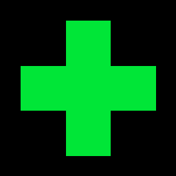 | 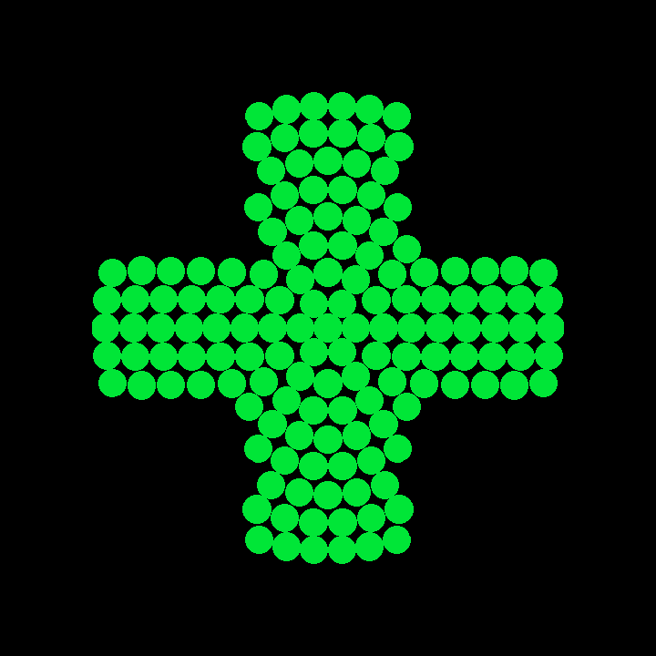 |
| **Letterlijke STOP** — red octagon, white ring. Fits the "StopNu" theme. | 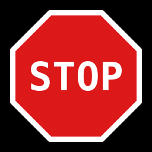 | 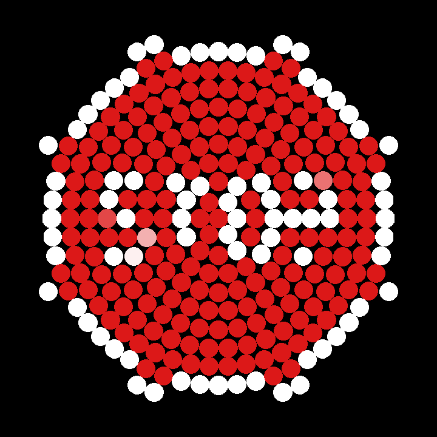 |
| **Ampelmännchen — rood** (halt, arms spread) |  | 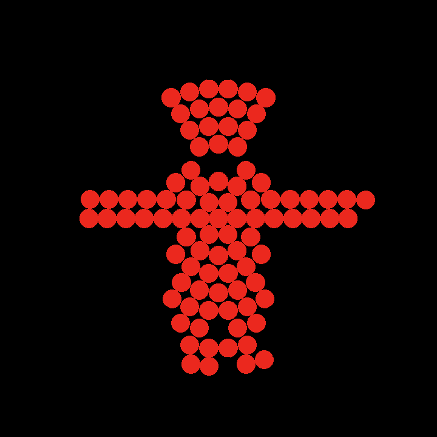 |
| **Ampelmännchen — groen** (loop, striding) | 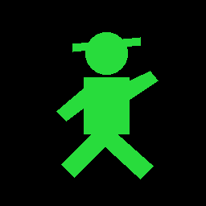 | 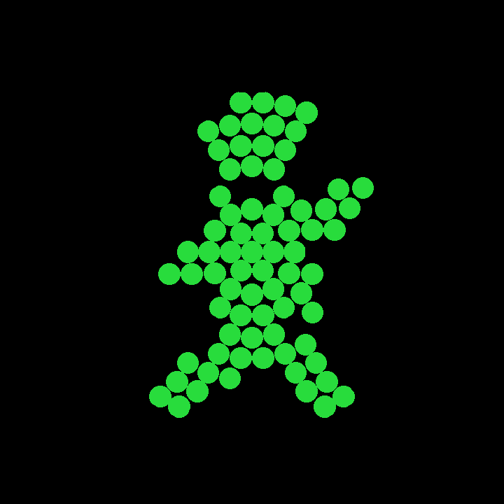 |

### Animated

The pharmacy cross blinking, and the Ampelmännchen switching red↔green — rendered
straight on the disc:

| Apotheek (blink) | Ampelmännchen (rood ↔ groen) |
|---|---|
|  |  |

## Extras

| | | | | |
|---|---|---|---|---|
| 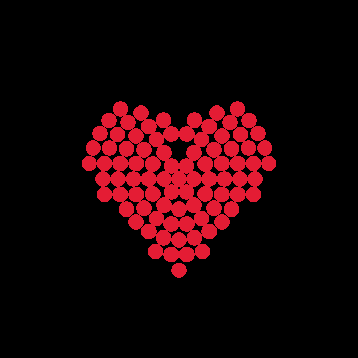 | 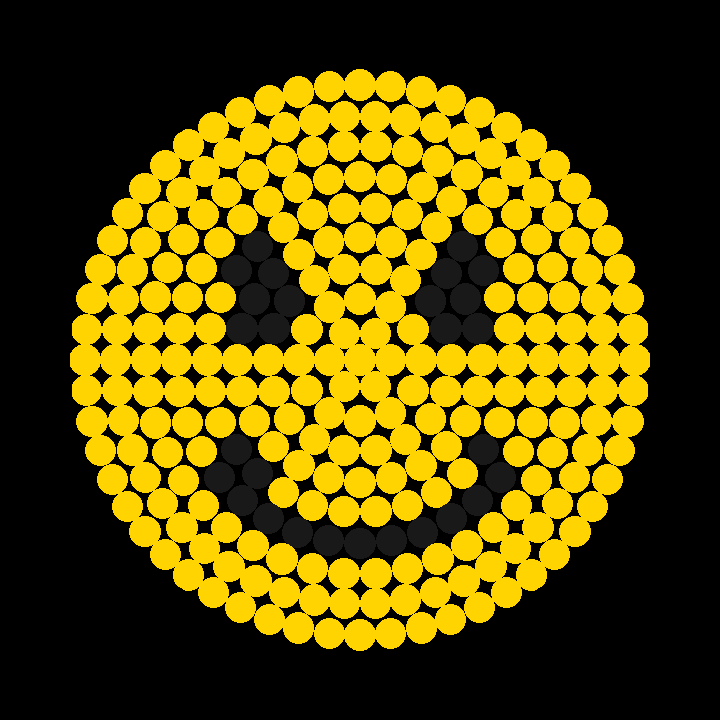 | 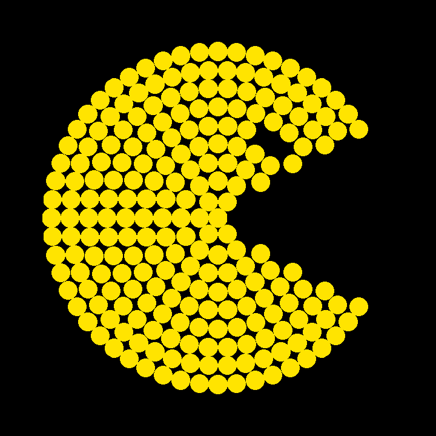 | 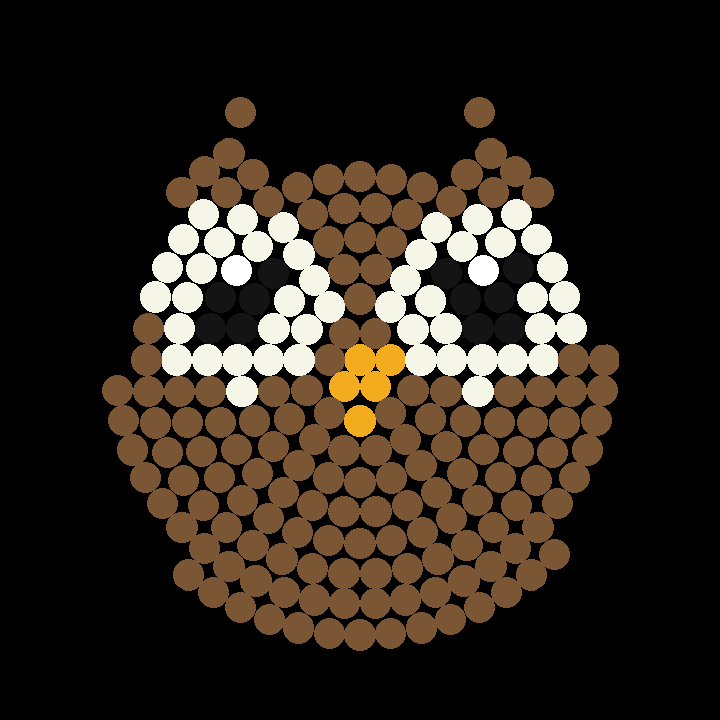 | 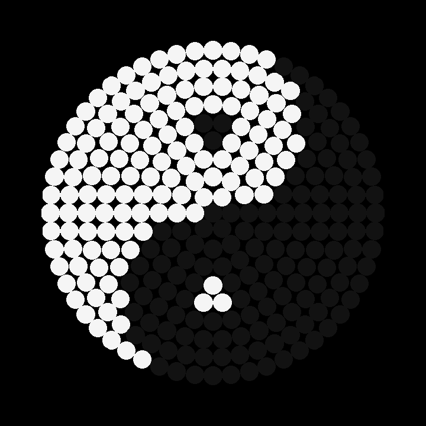 |
| Hart | Smiley | Pac-Man | NightOwl uil | Yin-yang |
| 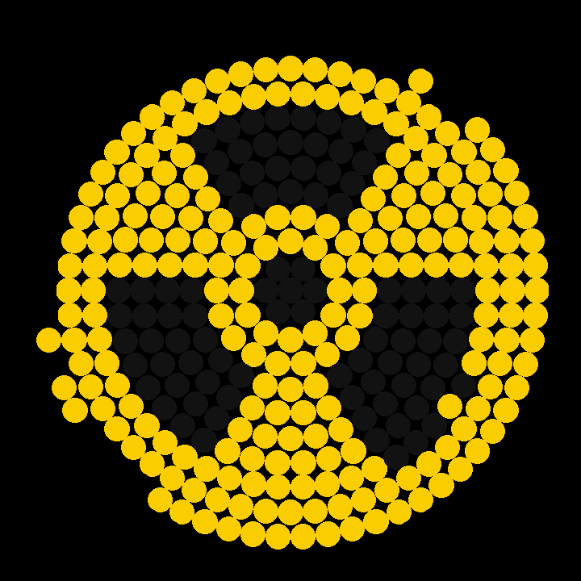 | | | | |
| Radioactief | | | | |

## Make your own

Anything bold works: a single bright letter, a flag (horizontal colour bands), a
clock face, a country roundel, a peace sign. Draw 256×256 with a transparent/black
background, keep the subject inside the centre circle (corners fall outside the
disc), and feed it to the simulator or `disc_driver.py --image`. The generator for
the icons above is `tools/build_examples.py`.
