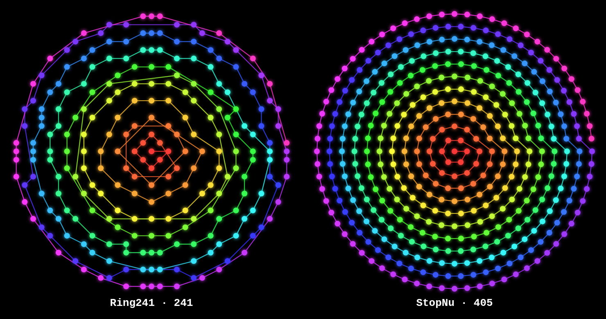
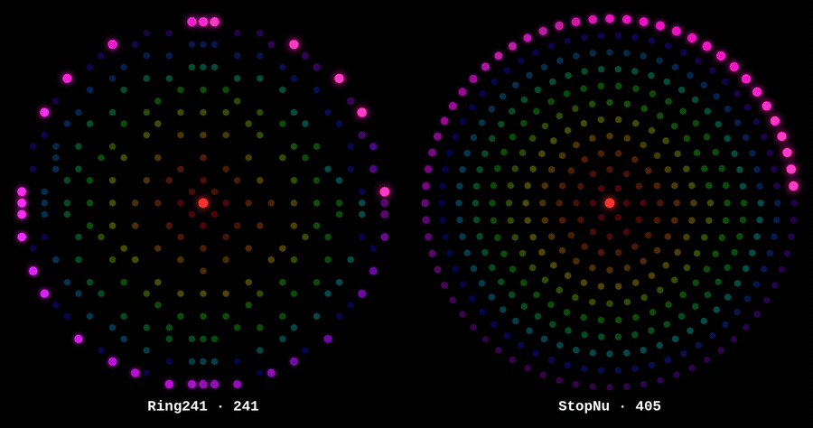
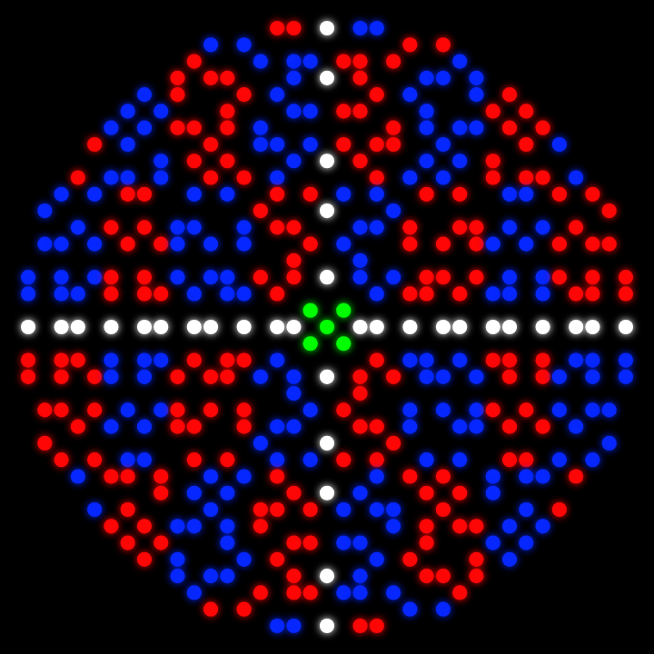
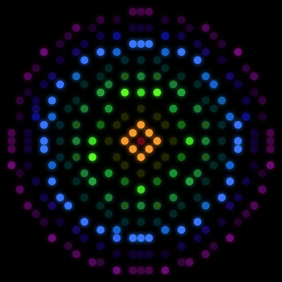

# Guurtje — round LED disc simulator

Browser preview for projecting images / GIFs / video onto circular WS2812
LED discs (concentric rings), so you can see what a picture looks like on the
ring layout **before** wiring anything. Aimed at driving the real hardware with
[WLED](https://kno.wled.ge/) (or the [MoonModules WLED-MM](https://mm.kno.wled.ge/)
fork for image/GIF effects).

Open **`ring241-sim.html`** in any browser. Single file, no build, works offline.

*Nyan Cat projected on the 405-LED StopNu disc — rendered from the actual tool.*

*Both supported lamps running the same source: Ring241 (241) vs StopNu (405).*

### Spiral ordering

A continuous spiral threaded through every LED (ring-bucket by radius, then by
angle) — center to rim — for both lamps. StopNu's *actual* WS2812 wiring order
(D1→D405) already traces this spiral, since it is wired ring by ring.

| Test grid (calibration) | Rainbow, polar wrap | Ring241 (241 leds) |
|---|---|---|
|  |  |  |

## Models

| Model | LEDs | Geometry source |
|-------|------|-----------------|
| **Ring241** | 241 | [MoonModules MM-Effects `Ring241 2D33.json`](https://github.com/MoonModules/MM-Effects/blob/master/Ledmaps/Ring241/Ring241%202D33.json) WLED 2D ledmap (33×33 grid) |
| **Bornhack StopNu** | 405 | [badgeteam BH20XX-StopNu](https://github.com/badgeteam/BH20XX-StopNu) PCB component-placement coords (`..._top_cpl.csv`), 12 rings, idx 1–405 |

Both feed a unified per-LED struct `{idx, nx, ny, r, a, rank, ringIx}`
(normalised disc coords + spiral rank), so the renderer, image sampler and
geometry effects are all model-agnostic.

### Load any disc (auto-detect)

Drop a file into **Model → load**; the format is sniffed automatically:

| File | Detected as | Builder |
|------|-------------|---------|
| WLED `ledmap.json` (`{width,map}` or bare array) | grid | `buildFromGrid` |
| Coords `.csv` with `x,y` (+ optional index) | coords | `buildFromCoords` |
| KiCad/EDA placement `.csv` (`Designator,Mid X,Mid Y`) | CPL | `buildFromCoords` |
| Ring-spec `.csv` (`count` + `radius`/`straal` per ring) | ring spec | `buildFromRingSpec` |

Adding a built-in model is still one entry in the `MODELS` registry.

## Features

- Built-in **Nyan Cat** (procedural, no CORS hassle), rainbow, calibration grid
- **Drop your own** GIF / image / video → projected onto the disc (animated GIFs animate live)
- **Geometry effects** (no image, computed per-LED from disc geometry): spiral
  chase, rainbow **rings** pulse, rotating **conic** rainbow — work on any model
- **Gridify** button: rasterise any disc to a square WLED 2D grid in one click
- Projection: zoom, pan, spin, angle, cover/1:1, **polar wrap** (image wound around the rings)
- LED look: brightness, gamma, dot size, glow, index overlay
- Export: PNG snapshot · WebM recording · **WLED `ledmap.json`** (rasterises the
  disc to a 2D grid) · raw `coords.csv`

### Grid a disc · rainbow-ring a disc

*Left: StopNu's 405 LEDs gridified onto a 37×37 WLED matrix (0 collisions).
Right: the `rings` geometry effect — concentric rainbow — on the Ring241 disc.*

### Driving real hardware

The **WLED ledmap.json** button rasterises the active model's LED positions onto
a square grid and resolves cell collisions, so you get a drop-in 2D ledmap.
StopNu exports cleanly as **37×37, all 405 LEDs, 0 collisions**. Upload it in
WLED under *Config → 2D → Set up ledmap*, then any 2D effect (or the WLED-MM
image/GIF effect) plays on the disc.

To push the *same* effects/images onto real LEDs from a script — over WLED
realtime **DDP/DNRGB**, the WLED **JSON API** (curl), or **direct hardware SPI**
on a Raspberry Pi — see **[hardware/HARDWARE.md](hardware/HARDWARE.md)** and
`hardware/disc_driver.py` (reads the coords in [`data/`](data/)).

For a **drop-in WLED bundle** (ledmap + 10 disc-tuned presets) for the Ring241 /
AliExpress 241-LED disc, see **[wled/ring241/](wled/ring241/)** — upload two files
with `curl`, set the matrix to 33×33, done.

## Notes / TODO

- **StopNu uses real PCB coordinates** — start angle and winding are already
  baked in from the placement file, no guessing. Ring241 positions come from
  its grid ledmap.
- LED indices shown are **0-based** (WLED order). On the StopNu board the
  silkscreen `D#` = `idx + 1`.
- To drive hardware: upload the matching ledmap into WLED (Config → 2D →
  Set up ledmap). Vanilla WLED has no native GIF playback; use WLED-MM's image
  effect for that.
- StopNu (and any coord-based disc) can be turned into a rectangular WLED 2D
  grid via the **Gridify** button or the **ledmap.json** export — StopNu
  rasterises to 37×37 with 0 collisions.
