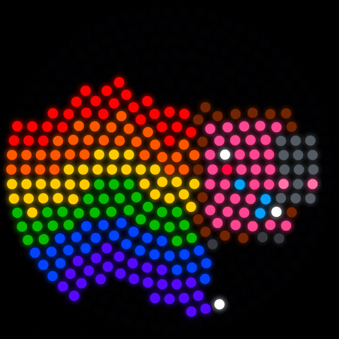
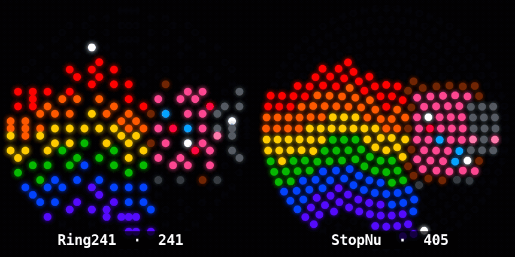
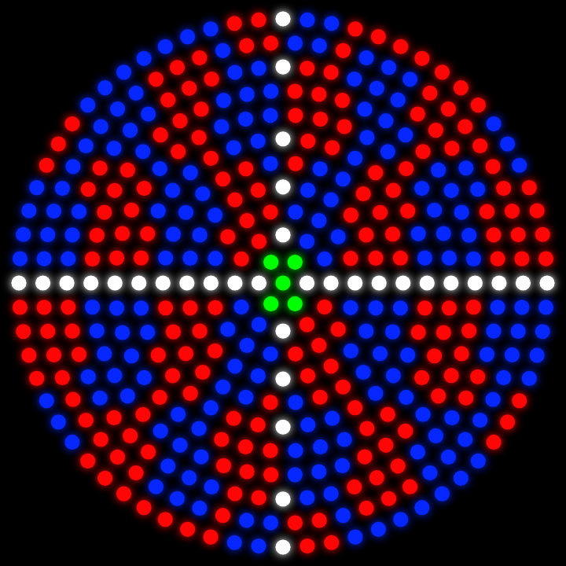
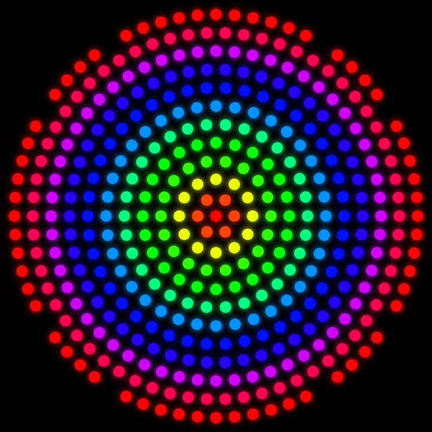
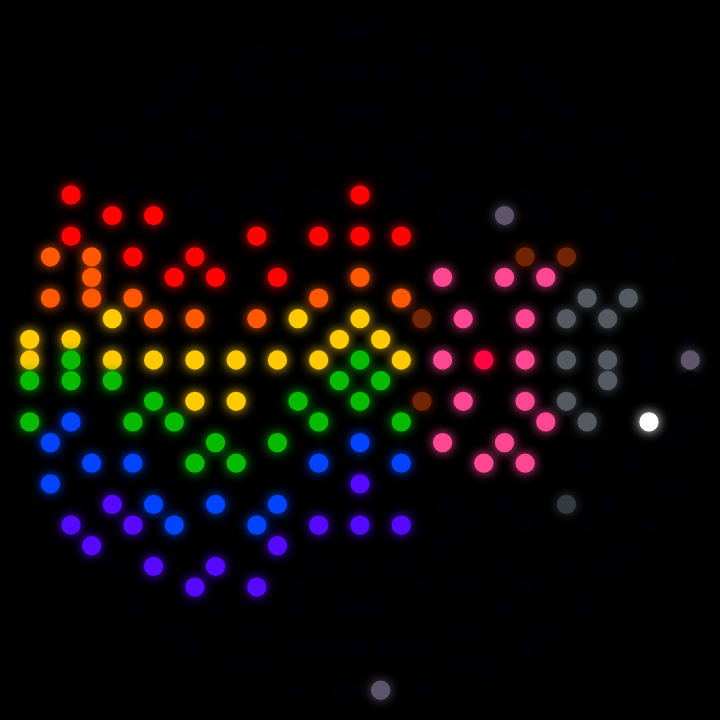

# guurtje — round LED disc simulator

Browser preview for projecting images / GIFs / video onto circular WS2812
LED discs (concentric rings), so you can see what a picture looks like on the
ring layout **before** wiring anything. Aimed at driving the real hardware with
[WLED](https://kno.wled.ge/) (or the [MoonModules WLED-MM](https://mm.kno.wled.ge/)
fork for image/GIF effects).

Open **`ring241-sim.html`** in any browser. Single file, no build, works offline.

*Nyan Cat projected on the 405-LED StopNu disc — rendered from the actual tool.*

*Both supported lamps running the same source: Ring241 (241) vs StopNu (405).*

| Test grid (calibration) | Rainbow, polar wrap | Ring241 (241 leds) |
|---|---|---|
|  |  |  |

## Models

| Model | LEDs | Geometry source |
|-------|------|-----------------|
| **Ring241** | 241 | [MoonModules MM-Effects `Ring241 2D33.json`](https://github.com/MoonModules/MM-Effects/blob/master/Ledmaps/Ring241/Ring241%202D33.json) WLED 2D ledmap (33×33 grid) |
| **Bornhack StopNu** | 405 | [badgeteam BH20XX-StopNu](https://github.com/badgeteam/BH20XX-StopNu) PCB component-placement coords (`..._top_cpl.csv`), 12 rings, idx 1–405 |

Both feed a unified per-LED struct `{idx, nx, ny, r, a}` (normalised disc
coords, screen frame), so the renderer and image sampler are model-agnostic.
Adding a model = one entry in the `MODELS` registry (a grid ledmap → 
`buildFromGrid`, or real x/y coords → `buildFromCoords`).

## Features

- Built-in **Nyan Cat** (procedural, no CORS hassle), rainbow, calibration grid
- **Drop your own** GIF / image / video → projected onto the disc (animated GIFs animate live)
- Projection: zoom, pan, spin, angle, cover/1:1, **polar wrap** (image wound around the rings)
- LED look: brightness, gamma, dot size, glow, index overlay
- Export: PNG snapshot · WebM recording · **WLED `ledmap.json`** (rasterises the
  disc to a 2D grid) · raw `coords.csv`

### Driving real WLED

The **WLED ledmap.json** button rasterises the active model's LED positions onto
a square grid and resolves cell collisions, so you get a drop-in 2D ledmap.
StopNu exports cleanly as **37×37, all 405 LEDs, 0 collisions**. Upload it in
WLED under *Config → 2D → Set up ledmap*, then any 2D effect (or the WLED-MM
image/GIF effect) plays on the disc.

## Notes / TODO

- **StopNu uses real PCB coordinates** — start angle and winding are already
  baked in from the placement file, no guessing. Ring241 positions come from
  its grid ledmap.
- LED indices shown are **0-based** (WLED order). On the StopNu board the
  silkscreen `D#` = `idx + 1`.
- To drive hardware: upload the matching ledmap into WLED (Config → 2D →
  Set up ledmap). Vanilla WLED has no native GIF playback; use WLED-MM's image
  effect for that.
- StopNu has no rectangular grid ledmap yet — would need rasterising the coords
  onto a grid for WLED 2D. Not done.
