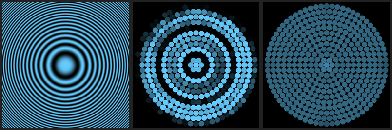

# Rendering quality

A LED disc is a **sparse, low-bit-depth, non-rectangular** display: a few hundred
points, 8 bits per channel, on circles. Naively mapping an image to it looks bad —
aliased and banded. This is what the pipeline does to fix that, and the knobs you
get. Everything here runs identically in the browser sim (so the preview matches)
and in `hardware/disc_driver.py` (so real LEDs match the preview).

Pipeline per LED, per frame:

```
source (image / GIF / effect)
  → sample at the LED's position      ← sub-pixel / anti-aliasing
  → gamma correct (8-bit perceptual)  ← gamma
  → scale brightness
  → quantise to 8-bit, dithered       ← temporal dithering
  → GRB byte triple → WS2812 / WLED
```

---

## 1. Sub-pixel rendering (anti-aliasing)

A disc has only ~20 LEDs across a 256-px image, so **nearest-neighbour sampling
throws away ~99% of the picture and aliases**: fine detail collapses into false
rings / moiré that aren't in the source.

`--filter` (driver) / *Sub-pixel · anti-alias* toggle (sim):

| mode | what | cost |
|------|------|------|
| `nearest` | one source pixel per LED | cheapest, aliases |
| `bilinear` | 4-tap sub-pixel — smoother edges & motion | cheap, still aliases fine detail |
| `area` *(default)* | **adaptive**: sharp centre, average the footprint *only where it straddles an edge* | 9 taps/LED |

**Adaptive** is the important one and answers the obvious objection ("don't just
blur everything"): it takes a sharp centre sample, then samples a 3×3 grid across
the LED's footprint. If those taps agree (flat region) it keeps the **crisp centre
value, untouched**. Only where they disagree (an edge) does it blend toward their
mean — and even then it keeps 30 % of the crisp value so bold graphics don't wash
out. So flat colour fields stay pixel-sharp; only the genuinely *ambiguous*
boundary LEDs get anti-aliased.



*nearest | area. The cross interior is byte-identical under `area`; only its edge
LEDs soften. The zone plate's fine outer rings — which the disc physically can't
resolve — average to their true tone instead of aliasing into false rings.*

Verified, not hand-waved: a flat fill comes out **identical** to nearest
(0 of 132 interior LEDs change); a half-green/half-black split only alters the
35-LED seam.

Inherent trade-off: a feature only ~3 LEDs wide (a thin cross arm) is *mostly*
edge, so those LEDs show partial coverage (correct) rather than snapping to full
colour. For maximum punch on bold 2-colour graphics, turn AA **off** (pure
nearest). For photos / high-frequency content, leave it **on**.

---

## 2. Gamma — these are 24-bit LEDs

WS2812 are **24-bit, 8/8/8, GRB**: 16.7 M colours but only **256 steps per
channel**, and the PWM is **linear** while your eye is logarithmic. Without gamma,
mid-tones look too bright and dim fades band.

- driver: `--gamma` — default **2.2** for `spi`/`preview` (the driver is the final
  stage), **1.0** for the WLED backends (WLED applies its own — don't double it).
- sim: the **gamma** slider, so you can preview where a fade lands.

---

## 3. Temporal dithering (sub-LSB brightness)

256 levels per channel isn't much at the bottom: below ~10/255 WS2812 have very few
distinct levels and shift colour. `--dither` adds **temporal error diffusion** — a
target of `5.4/255` is emitted as a `5,6,5,6,…` sequence that *averages* to 5.4,
recovering brightness between the 8-bit steps and killing visible stepping in slow
fades. Needs a steady frame rate; costs nothing.

```
target 5.4  →  5 6 5 6 5 5 6 5 6 …   mean = 5.400   (vs a flat 5 without dither)
```

---

## How they stack

- **Sub-pixel (area)** fixes *spatial* detail — what colour each LED should be.
- **Gamma** fixes *tone* — linear PWM vs perceptual brightness.
- **Temporal dither** fixes *amplitude* quantisation — sub-LSB levels over time.

Together, on slow motion, the disc can look **finer than its LED pitch**: sub-pixel
positioning + sub-LSB brightness average in the eye. Spatial AA in space, dither in
time.

See **[hardware/HARDWARE.md](hardware/HARDWARE.md)** for the transport/wiring/power
side, and the [`disc_driver.py`](hardware/disc_driver.py) `--filter / --gamma /
--dither` flags.
